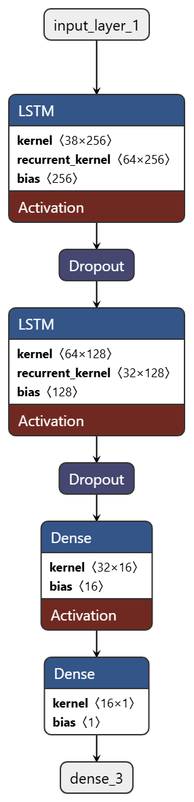

# Appliance Energy Prediction Using Deep Learning

## Project Overview
This project predicts energy consumption of appliances in a low-energy building using a multivariate time-series dataset. The pipeline includes data preprocessing, temporal feature engineering, and Deep Learning models (LSTM and GRU) to forecast energy usage.

### Model Architecture


## What I Did

### 1. Data Prep
- **Missing Values & Noise:** I used time-based interpolation to fill missing values and dropped `rv1` and `rv2` since they seemed to just be random noise.
- **Outliers:** I applied Winsorization at the 99th percentile to cap some of the extreme energy spikes so they wouldn't throw off the model.
- **Scaling:** Used `MinMaxScaler`, but I made sure to fit it **only on the training set** to prevent data leakage into the test set.

### 2. Feature Engineering
Since time-series forecasting needs explicit time features, I added a few things:
- **Datetime Features:** Hour, day of the week, and weekend flags. I also added some sine/cosine transformations so the neural net understands the cyclical nature of time.
- **Rolls & Lags:** Computed 1-hour and 3-hour rolling averages. **Importantly, I added a `.shift(1)` step** before rolling to make sure the model never accidentally looks at current-interval data (which would be cheating).
- **Interactions:** Added some simple domain features like indoor vs outdoor temperature difference (`T1 - T_out`), which directly impacts heating/cooling.

### 3. Modeling
- **Data Formatting:** Converted the 2D pandas data into 3D tensors `(batch_size, time_steps, features)` for the Keras recurrent layers, using a sliding window of `time_steps=6` (1 hour of past data).
- **LSTM / GRU:** Tried out Long Short-Term Memory (LSTM) and GRU networks to catch those non-linear trends.
- **Regularization:** Used `Dropout(0.2)` to drop 20% of the nodes during training to prevent overfitting.
- **Training:** Used the Adam optimizer with MSE loss and added an EarlyStopping callback to stop training when the validation loss stopped improving.

## Project Structure
```text
├── data/ 
│   ├── raw/                 # Download the dataset here 
│   └── processed/           # Cleaned data goes here
├── notebooks/ 
│   ├── EDA.ipynb            # Data exploration and plots
│   └── Model_Training_Pipeline.ipynb # Main training script
├── src/ 
│   ├── data_preprocessing.py # Cleaning, outlier handling, scaling
│   ├── feature_engineering.py # Time features, lags, rolling averages
│   ├── model.py             # LSTM and baseline model definitions
│   └── train.py             # Training loop and evaluation
├── models/                  # Saved .h5 models
├── reports/                 # Results and writeups
├── requirements.txt         # Dependencies
└── README.md                # You are here
```

## How to Run

1. **Set up your environment**:
   ```powershell
   python -m venv .venv
   .\.venv\Scripts\Activate.ps1
   pip install -r requirements.txt
   ```
2. **Add the data**: 
   Download the "Appliance Energy Prediction Dataset" and save it as `energy_data_set.csv` in the `data/raw/` folder.

3. **Run it**:
   Open VS Code, activate the `.venv`, and just run all cells in `notebooks/Model_Training_Pipeline.ipynb`. It'll process the data, train the LSTM, and print out the final MAE and RMSE scores.
